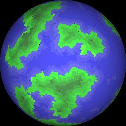
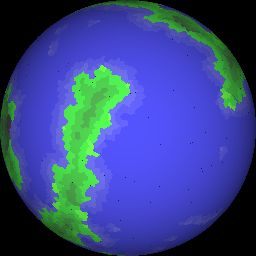
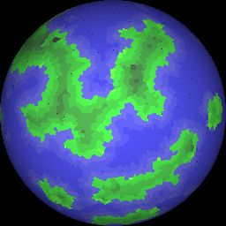
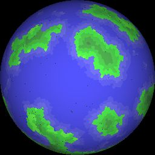
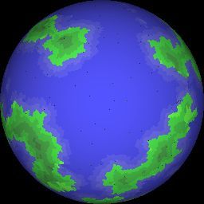

# globular-marauders-generator
Tool to generate meshes for the game. The first goal is to generate prefab planets.

## 10 Generated Planets for in game usage

These images are stored in a JSON mesh format containing 3d data and images